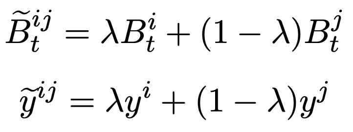
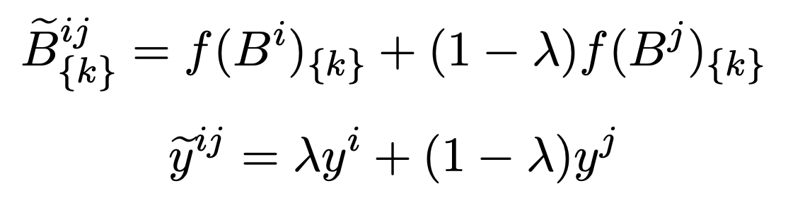

# Data Augmentation for Natural Language Processing

## Approach

### Synonym Replacement

- **Definition:** randomly choose _n_ words from the sentence that are not stop words. Replace each of these words with one of its synonyms chosen at random
- **From**: Wei, Jason, and Kai Zou. "Eda: Easy data augmentation techniques for boosting performance on text classification tasks." *arXiv preprint arXiv:1901.11196* (2019).

### Random Insertion

- **Definition:** Find a random synonym of a random word in the sentence that is not a stop word. Insert that synonym into a random position in the sentence. Do this _n_ times.
- **From**: Wei, Jason, and Kai Zou. "Eda: Easy data augmentation techniques for boosting performance on text classification tasks." *arXiv preprint arXiv:1901.11196* (2019).

### Random Swap

- **Definition:** randomly choose two words in the sentence and swap their positions. Do this _n_ times.

- **From**: Wei, Jason, and Kai Zou. "Eda: Easy data augmentation techniques for boosting performance on text classification tasks." *arXiv preprint arXiv:1901.11196* (2019).

### Random Deletion

- **Definition:** randomly remove each word in the sentence with probability _p_.

- **From**: Wei, Jason, and Kai Zou. "Eda: Easy data augmentation techniques for boosting performance on text classification tasks." *arXiv preprint arXiv:1901.11196* (2019).

### wordMixup and senMixup

- It applies Mixup, which is a data augmentation method, on Natural Language Processing. Targeting the sentence classification task, one performs interpolation on word embeddings (**wordMixup**) and another on sentence embeddings (**senMixup**).
  - **wordMixup:** given a piece of text, such as a sentence with _N_ words, it can be represented as a matrix _B_. Each row _t_ of the matrix correspond to one word _B^t^_. For a pair of samples (B^i^, y^i^) and (B^j^, y^j^), we can generate a synthetic sample (B~t~^ij^, y^ij^):
    -  
  - **senMixup:** let $f$ denote the sentence encoder, then a pair of sentences B^i^​ and B^j^ will be encoded into a pair of sentence embedding f(B^i^)​ and f(B^j^).  we can generate a synthetic sample 
    - 
- **From:** Guo, Hongyu, Yongyi Mao, and Richong Zhang. "Augmenting data with mixup for sentence classification: An empirical study." *arXiv preprint arXiv:1905.08941* (2019).